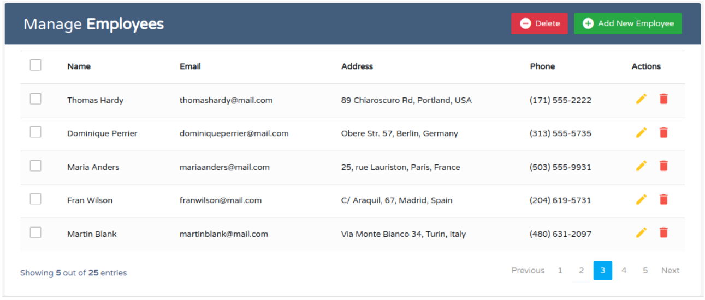

# Experimento Copilot

## Desafio 02 

Implemente um HTML que apresente a seguinte estrutura. Implemente apenas o frontend, não é necessário implementar o backend.

## Layout




## Tempo correspondente:

```shell
com copilot    00:28:09
```

## Referências
  - [BootstrapCDN](https://www.bootstrapcdn.com/)
  - [Bootstrap Icons](https://icons.getbootstrap.com/)
  - [CSS Reset](https://www.devmedia.com.br/como-utilizar-a-tecnica-css-reset/26797)

